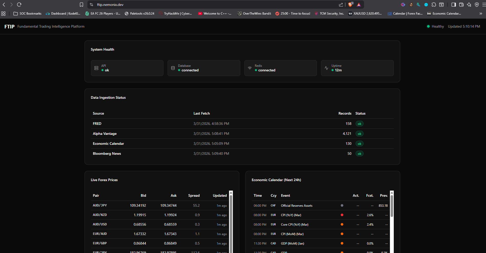
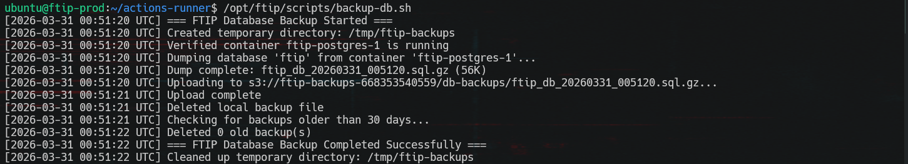
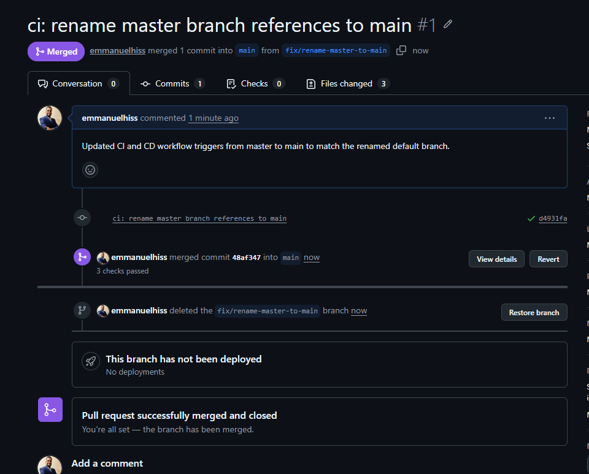
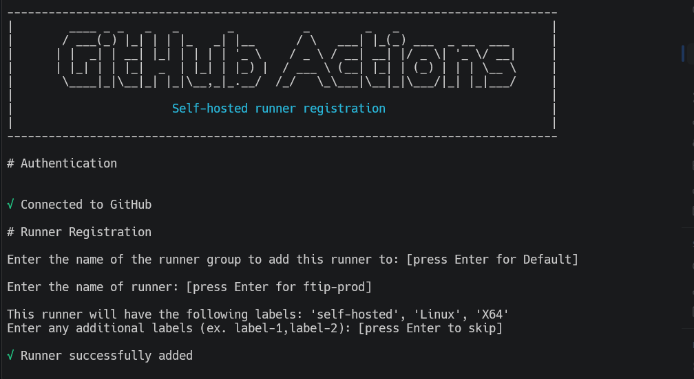
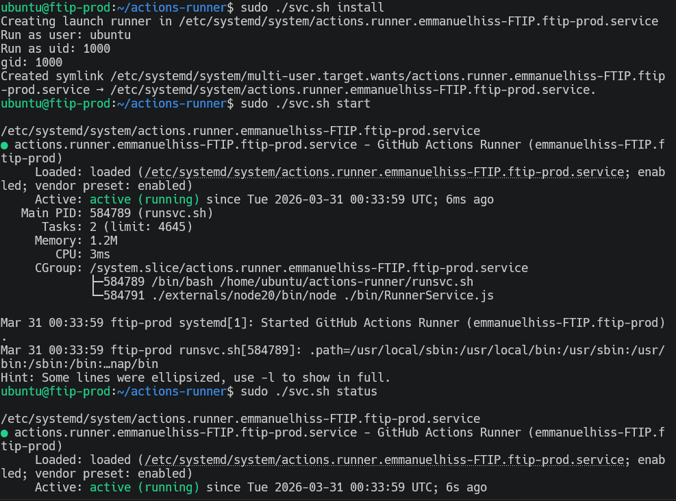
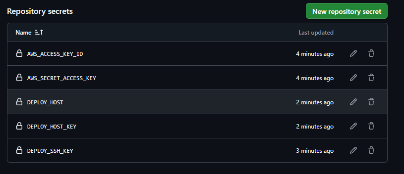
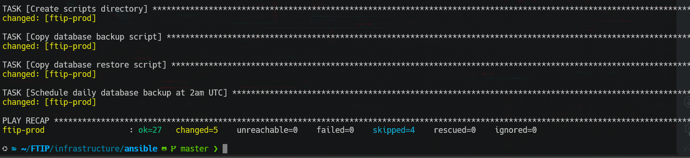

# FTIP — Fundamental Trading Intelligence Platform

> Full-stack trading research platform — async Python backend ingesting macro-economic data from 4 sources across 8 currencies, React dashboard, Redis Streams event bus, deployed to a homelab via CI/CD with Terraform, Ansible, and Cloudflare Tunnel.

**Live:** [ftip.nemonix.dev](https://ftip.nemonix.dev) | **API:** [api-ftip.nemonix.dev](https://api-ftip.nemonix.dev/api/health)

## Why I Built This
I actively trade forex. I was manually checking 32+ economic indicators across 8 currencies on different websites — central bank rates, inflation, GDP, unemployment. That's slow and error-prone. FTIP automates the data collection and will eventually use AI agents to score currency strength and flag opportunities.

This isn't a tutorial project. The requirements come from real trading experience. NemonixCentral was my first attempt — US-only data, monolithic, AWS Bedrock. FTIP is the redesign: 8 currencies, microservices, event-driven, cloud-native from day one.

---

## Live Dashboard

React + Vite + shadcn/ui + TanStack Query. Dark mode trading interface with auto-refresh every 30 seconds. Six panels: System Health, Data Ingestion Status, Live Forex Prices, Economic Calendar, Recent News.



---

## Architecture

```
                    ┌─────────────────────────────────────────────┐
                    │              Data Sources                    │
                    │  FRED API · Alpha Vantage · Investing.com   │
                    │           · Financial News APIs              │
                    └──────────────────┬──────────────────────────┘
                                       │
                    ┌──────────────────▼──────────────────────────┐
                    │         Ingestion Service (async)            │
                    │  4 independent fetch loops · release monitor │
                    │  rate limiting · graceful shutdown            │
                    └────┬─────────────────────┬──────────────────┘
                         │                     │
              ┌──────────▼──────────┐  ┌───────▼────────┐
              │    PostgreSQL 16     │  │  Redis Streams  │
              │  5 tables · indexes  │  │   4 streams     │
              │  Alembic migrations  │  │  10k msg cap    │
              └──────────▲──────────┘  └───────┬─────────┘
                         │                     │
              ┌──────────┴──────────┐  ┌───────▼─────────┐
              │   FastAPI REST API   │  │   AI Agents      │
              │  11 endpoints · async│  │  (Phase 3)       │
              │  Pydantic v2 schemas │  │  base pattern    │
              └──────────▲──────────┘  │  ready            │
                         │             └──────────────────┘
              ┌──────────┴──────────┐
              │   React Dashboard    │
              │  Vite · shadcn/ui    │
              │  TanStack Query      │
              └──────────┬──────────┘
                         │
              ┌──────────▼──────────┐
              │  Cloudflare Tunnel   │
              │  ftip.nemonix.dev    │
              └─────────────────────┘
```

---

## What It Does

### API Service — 11 Endpoints

| Endpoint | What It Returns |
|---|---|
| `GET /api/health` | DB + Redis connection status |
| `GET /api/system/status` | Full system health — API, DB, Redis, uptime |
| `GET /api/ingestion/status` | Per-source ingestion stats — last fetch time, record counts, status |
| `GET /api/currencies/rates` | All 8 central bank interest rates with direction (hiking/cutting/hold) |
| `GET /api/currencies/indicators/{currency}` | Latest interest rate, inflation, GDP, unemployment for one currency |
| `GET /api/currencies/indicators` | Same as above for all 8 currencies |
| `GET /api/forex/prices` | Latest snapshot for all 15 tracked pairs |
| `GET /api/forex/prices/{pair}` | Latest + 24h history for a single pair (handles EUR/USD, EURUSD, EUR-USD) |
| `GET /api/calendar?currency=USD&impact=high&days=7` | Upcoming economic events with filters |
| `GET /api/calendar/releases` | Recent data releases with actual vs forecast values |
| `GET /api/news?category=fx` | Latest financial news with filters |


### Frontend — React Dashboard

| Feature | Details |
|---|---|
| **System Health** | API, Database, Redis status with uptime indicator |
| **Data Ingestion Status** | Per-source: FRED (158 records), Alpha Vantage (4,121), Economic Calendar (130), News (50) — all with last fetch timestamp |
| **Live Forex Prices** | Bid/ask/spread for all tracked pairs, updated every 30 seconds |
| **Economic Calendar** | Next 24h events with impact levels (high/medium/low), currency, actual vs forecast |
| **Recent News** | Financial news headlines with category tagging |

Built with React + Vite, styled with shadcn/ui, data fetching via TanStack Query with 30-second auto-refresh. Served through nginx, containerized with Docker, deployed via the same CD pipeline.

### Ingestion Service — 4 Data Sources

| Source | What It Fetches | Schedule | Details |
|---|---|---|---|
| **FRED** | 32 economic series (interest rates, CPI, GDP, unemployment) | Every 6 hours | 8 currencies x 4 categories. Rate-limited 1s/call. Updates central bank state with direction tracking. |
| **Alpha Vantage** | 15 forex pairs (7 majors, 7 crosses, XAU/USD gold) | Every 5 minutes | Bid/ask/mid prices. Rate-limited under 75 req/min. |
| **Investing.com** | Economic calendar events | Every 6 hours | Headless browser rendering to bypass Cloudflare. JavaScript injection to call internal API. |
| **Financial News** | Market news headlines | On demand | Headless browser rendering. Automatic currency detection across 20+ codes. |


### Release Monitor
The ingestion service includes a real-time release monitor that runs every 60 seconds. It watches for imminent high-impact economic events (within a 7-minute window), triggers a scrape when an event is due, retries up to 5 times at 30-second intervals to capture actual values, and publishes a RELEASE event to Redis when the number drops.

### Redis Streams — Event-Driven Architecture
4 streams serve as the message bus between services:

| Stream | Source | Consumer (Phase 3) |
|---|---|---|
| `raw_indicators` | FRED economic data | Scoring Agent |
| `raw_prices` | Alpha Vantage forex | Pricing Agent |
| `raw_calendar` | Economic calendar events | Calendar Agent |
| `raw_news` | Financial news headlines | Sentiment Agent |

Each stream rotates at 10,000 messages. The agent service has an abstract base pattern ready — each agent reads from input streams, processes, writes to an output stream + PostgreSQL.

---

## Database Schema — 5 Tables

| Table | Key Columns | Constraints |
|---|---|---|
| `economic_indicators` | series_id, currency, category, value (NUMERIC 20,4), observation_date | UNIQUE(series_id, observation_date). Indexes on currency, category. |
| `forex_prices` | pair, bid_price, ask_price, price (NUMERIC 12,5), snapped_at | Index on (pair, snapped_at DESC) for time-series queries. |
| `cb_state` | bank, currency, current_rate, previous_rate, direction | UNIQUE(bank). Tracks rate changes + direction (hiking/cutting/hold). |
| `calendar_events` | event_datetime, currency, title, impact, actual, forecast, previous | UNIQUE(title, event_datetime). Indexes on currency, impact, datetime. |
| `news_items` | source, headline, summary, url, category, related_currencies, published_at | UNIQUE(url). Indexes on source, category, published_at DESC. |

3 Alembic migrations: initial schema → widen numeric precision for GDP values → add calendar + news tables.

**Automated backups:** Daily at 2am UTC via cron. Script dumps PostgreSQL, compresses, uploads to S3, and prunes backups older than 30 days.



---

## Infrastructure — Everything is Code

### CI/CD Pipeline

```
Push to feature branch
    │
    ▼
Pull Request → main (branch protection: require PR + CI checks)
    │
    ▼
GitHub Actions CI
    ├── Ruff lint + format (3 services)
    ├── MyPy type check (3 services)
    ├── Docker image builds
    └── Docker Compose integration test (health check)
            │
            ▼ (merge to main)
GitHub Actions CD
    ├── Build + push to AWS ECR (dual tags: :latest + :sha-{commit})
    └── Deploy via self-hosted runner on homelab
            ├── SSH into FTIP VM
            ├── Pull images from ECR
            ├── docker compose up -d
            ├── Alembic migrations
            ├── Health check (12 retries, 5s intervals)
            └── Automatic rollback on failure (re-tag previous images)
```

**Branch protection on `main`:** Require pull request, require CI status checks, no bypass. First PR merged:



### Self-Hosted GitHub Actions Runner

The CD deploy job runs on a self-hosted runner installed directly on the homelab FTIP VM. Registered as `ftip-prod`, running as a systemd service so it persists across reboots.





### Secrets Management — Three Layers

| Layer | Tool | What It Protects |
|---|---|---|
| **CI/CD pipeline** | GitHub Secrets | AWS keys, SSH key, deploy host |
| **Server configuration** | Ansible Vault | Postgres password, API keys, .env values |
| **Application runtime** | `.env` on server | DB URL, Redis URL, API keys (templated by Ansible) |



### Terraform — Proxmox + AWS

**Proxmox** (homelab):
- Cloud-init Ubuntu 22.04 template (VM 9000) — new VMs in 30 seconds
- Custom `TerraformProvisioner` role with 16 specific privileges (not admin)
- FTIP VM: 4GB RAM, 2 cores, 50GB disk, static IP 10.10.10.50

**AWS** (ap-southeast-4 Melbourne):
- ECR: ftip-api + ftip-ingestion repos with lifecycle policies
- S3: Terraform state (with DynamoDB locking) + DB backups (versioned, encrypted)

Both managed from the same Terraform workflow with remote state.


 

### Ansible — Config Management + Deployment

| Playbook | What It Does |
|---|---|
| `setup-server.yml` | Install Docker, AWS CLI v2, configure UFW (allow 22 + 8000, deny rest), create app directory |
| `deploy-ftip.yml` | ECR login, pull images, template .env + docker-compose from Jinja2, start containers, run migrations, health check |
| `backup.yml` | Deploy backup/restore scripts, schedule daily cron at 2am UTC |

All secrets encrypted with **Ansible Vault** — AWS keys, Postgres password, API keys. Vault file is safe in Git.




### Cloudflare Tunnel — Public Access

FTIP is publicly accessible without exposing any ports on the home network. A Cloudflare Tunnel runs as a systemd service on the FTIP VM, routing:
- `ftip.nemonix.dev` → localhost:3000 (React dashboard)
- `api-ftip.nemonix.dev` → localhost:8000 (FastAPI)

No port forwarding, no dynamic DNS, no exposed firewall ports. Traffic goes through Cloudflare's network.

### Network Architecture

```
Internet → Cloudflare Tunnel → FTIP VM (10.10.10.50)
                                  ├── :3000 (React dashboard / nginx)
                                  └── :8000 (FastAPI API)

Home Router (192.168.4.1)
    ↓
Proxmox Host (192.168.4.93)
    ├── vmbr0 (WAN) ── OPNsense VM 101
    └── vmbr1 (LAN) ── OPNsense LAN (10.10.10.1)
                            ├── FTIP VM 103 (10.10.10.50)
                            └── WireGuard VPN (10.10.20.0/24)

Firewall: Lab → Home network BLOCKED. Lab → Internet ALLOWED (via NAT).
```

### Proxmox RBAC — Least Privilege


---

## Docker — Multi-Stage Builds

All services (API, ingestion, dashboard) follow the same pattern:
1. **Builder stage** (`python:3.12-slim` / `node:20-alpine`): Install deps (cached layer), copy source, build
2. **Runtime stage**: Copy only artifacts from builder, create non-root user, run with minimal footprint

Result: small images, no build tools in production, non-root execution, fast rebuilds from cached dependency layer. Dashboard served through nginx with API proxy config.

Dev overrides add: hot reload, debugpy (port 5678), volume mounts, exposed DB/Redis ports.

---

## Hard Problems I Solved

### 1. WSL2 + Docker PostgreSQL Auth
**Symptom:** Alembic migrations failed when run from WSL2 terminal
**Root cause:** WSL2 port forwarding + PostgreSQL scram-sha-256 auth don't play well together
**Fix:** Run migrations from inside the Docker container where internal DNS resolves correctly
**Learned:** Docker's internal networking is separate from the host — services should always connect through Docker DNS names, not localhost

```
WSL2 Terminal ──→ localhost:5432 ──→ ??? ──→ PostgreSQL
                  (port forward)     (auth fails)

Docker Container ──→ postgres:5432 ──→ PostgreSQL
                     (internal DNS)    (auth works)
```

### 2. uv Not Found in Runtime Stage
**Symptom:** API container crashed with `exec: "uv": executable file not found in $PATH`
**Root cause:** Multi-stage Dockerfile copies uv into builder but runtime is a clean `python:3.12-slim`
**Fix:** Add `COPY --from=ghcr.io/astral-sh/uv:latest /uv /uvx /bin/` to the runtime stage
**Learned:** Each `FROM` in a Dockerfile is a clean slate — nothing carries over unless explicitly COPY'd

### 3. Permission Denied + Dev Deps at Runtime
**Symptom:** Crash loop with `Permission denied (os error 13)` trying to install mypy
**Root cause:** `.venv` owned by root (from builder stage), runtime runs as `appuser`. Also `uv run` triggers sync of dev dependencies.
**Fix:** `RUN chown -R appuser:appuser /app` before `USER appuser`. CMD uses `uv run --no-sync`.
**Learned:** Non-root containers need explicit ownership of COPY'd directories. `uv run` without `--no-sync` syncs on every start.

### 4. Numeric Overflow on GDP Values
**Symptom:** `NumericValueOutOfRangeError` — entire batch failed on one value
**Root cause:** `NUMERIC(12, 4)` designed for percentages. Canada's GDP came back as 587,354,750,000 (12 digits).
**Fix:** Alembic migration widening to `NUMERIC(20, 4)`
**Learned:** Always check real data ranges before picking column precision

### 5. Six Invalid FRED Series IDs
**Symptom:** 6 of 32 FRED API calls returned HTTP 400. AUD and NZD missing interest rate data.
**Root cause:** Series IDs from documentation were deprecated or never existed in the public API
**Fix:** Used FRED search API to find valid replacements, verified each with real API call
**Learned:** Always validate external API data sources with real calls before hardcoding

| Failed ID | Replacement | Source |
|---|---|---|
| `RBATCTR` | `IRSTCI01AUM156N` | OECD Short-term Rate |
| `NZLOCRS` | `IRSTCI01NZM156N` | OECD Short-term Rate |
| `AUSGDPGDPVOVCPGPQ` | `NGDPRSAXDCAUQ` | OECD National Accounts |
| `NZLRGDPEXP` | `NZLGDPNQDSMEI` | OECD MEI |
| `LRHUTTTTNZM156S` | `LRUNTTTTNZQ156S` | OECD Labor Stats |
| `LRHUTTTTCHM156S` | `LMUNRRTTCHM156N` | OECD Registered Unemployment |

### 6. Proxmox RBAC — User, Role, Assignment are Three Separate Things
**Symptom:** Terraform 403 "Permission check failed (VM.Clone)" — user and role both existed
**Root cause:** Never **assigned** the role to the user. First fix also failed — Propagate unchecked.
**Fix:** Delete entry, re-add at path `/` with Propagate checked
**Learned:** RBAC = user + role + assignment. Same as AWS IAM — policy without attachment does nothing.

### 7. OPNsense NAT Rules Missing After VM Restart
**Symptom:** Lab VM pinged gateway but not internet. OPNsense itself had connectivity.
**Root cause:** GUI showed NAT rules but `pfctl -s nat` returned nothing — rules not loaded after unclean shutdowns
**Fix:** `configctl filter reload` — one command to push config into the live packet filter
**Learned:** GUI config ≠ running config. Always verify with CLI tools.

### 8. Terraform Disk Size Ignored During Clone
**Symptom:** VM had 2.2GB disk instead of 50GB. Ansible failed "No space left on device."
**Root cause:** Disk interface mismatch — template uses `scsi0`, Terraform had `virtio0`. Also missing `file_format = "raw"`.
**Fix:** Match interface to `scsi0`, add `file_format = "raw"`
**Learned:** Terraform disk config must exactly match the template's disk interface

---

## Tech Choices

| Choice | Why | Considered Instead |
|---|---|---|
| FastAPI | Async-native, Pydantic validation, auto OpenAPI docs | Django (too heavy), Flask (no async) |
| React + Vite + shadcn/ui | Fast builds, polished component library, TanStack for data fetching | Next.js (SSR overkill for dashboard), plain HTML (not maintainable) |
| SQLAlchemy 2.0 async | Type-safe ORM + async, Alembic migrations | Raw asyncpg (no migrations), Django ORM |
| Redis Streams | Persistent event streaming, lightweight message bus | Celery (task queue, wrong semantics), RabbitMQ (overkill) |
| uv | 10-100x faster than pip, proper lockfiles, cached Docker layers | pip (slow), poetry (slower) |
| Docker multi-stage | Small images, no build tools in prod, non-root user | Single-stage (bloated, insecure) |
| Terraform | Declarative IaC for Proxmox + AWS from one workflow | Manual setup (not reproducible) |
| Ansible + Vault | Idempotent config management, encrypted secrets in Git | Shell scripts (fragile, no idempotency) |
| Cloudflare Tunnel | Public access without exposing ports, free TLS, no port forwarding | Nginx reverse proxy + Let's Encrypt (more config, exposed ports) |
| Self-hosted runner | CD deploys directly to homelab, no cloud hosting needed | GitHub-hosted runner (can't reach private network) |
| Custom async scheduler | Zero dependencies, independent fetch loops, graceful shutdown | APScheduler (heavy), Celery Beat (overkill for 4 tasks) |

See the [Architecture Decision Records](../../decisions/) for detailed reasoning on each choice.

---

## Links
- **Live Dashboard:** [ftip.nemonix.dev](https://ftip.nemonix.dev)
- **Live API:** [api-ftip.nemonix.dev](https://api-ftip.nemonix.dev/api/health)
- **Repo:** github.com/emmanuelhiss/ftip
- **Decisions:** [Architecture Decision Records](../../decisions/)
