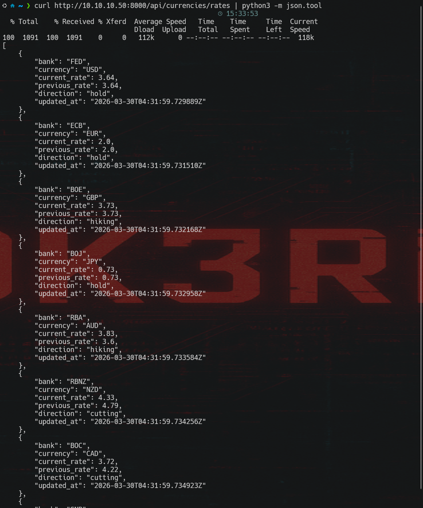
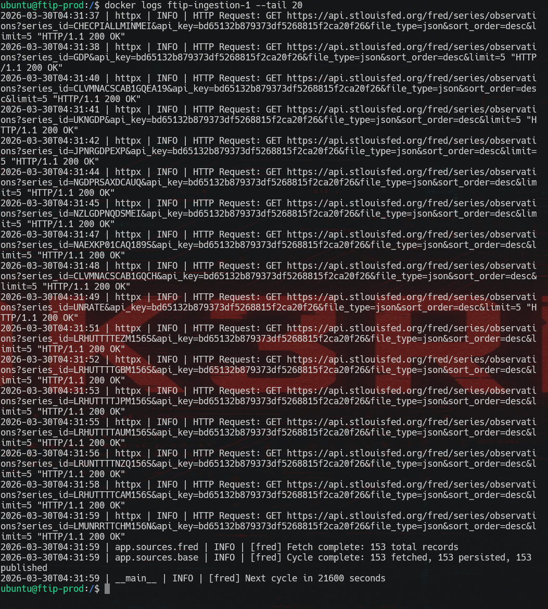
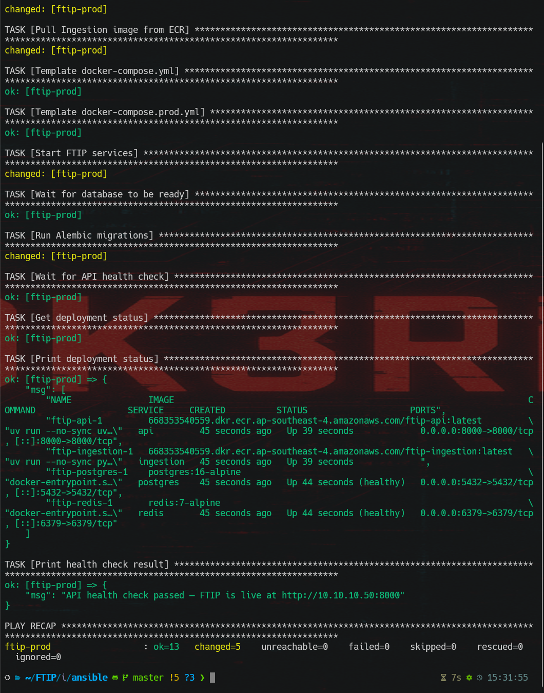
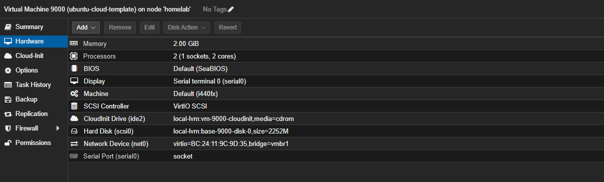
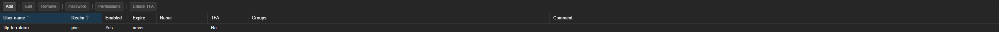
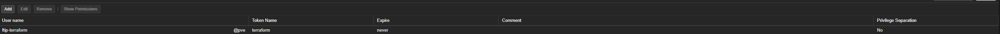
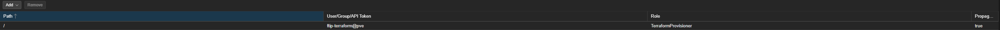
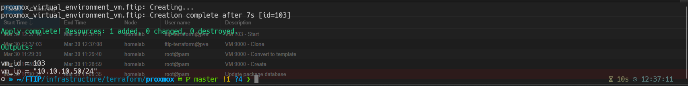
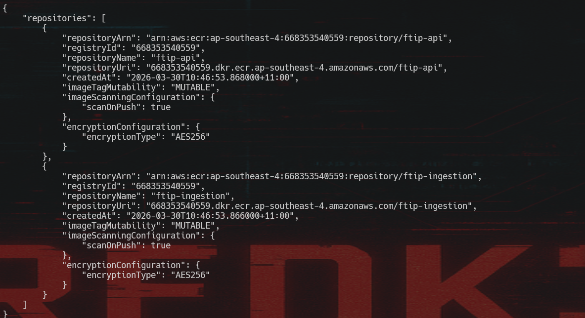
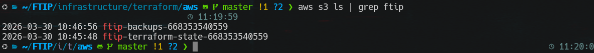

# FTIP — Fundamental Trading Intelligence Platform

## One-Liner
> Multi-agent AI trading research desk that ingests real macro-economic data from FRED and Alpha Vantage, exposes it through a FastAPI REST API, and uses Redis Streams as a message bus for AI agents that score currency strength.

## Why I Built This
I actively trade forex. I was manually checking 32+ economic indicators across 8 currencies on different websites — central bank rates, inflation, GDP, unemployment. That's slow and error-prone. FTIP automates the data collection and will eventually use AI agents to score currency strength and flag opportunities.

This isn't a tutorial project. The requirements come from real trading experience.

## Evolution from NemonixCentral
NemonixCentral was my first trading tool — US-only data, monolithic architecture, AWS Bedrock for AI. FTIP is the redesign: 8 currencies instead of 1, microservices instead of monolith, event-driven agents instead of request-response AI, cloud-native deployment from day one.

## Architecture
```
FRED API ──→ Ingestion Service ──→ PostgreSQL
Alpha Vantage ──→ Ingestion Service ──→ PostgreSQL
                  Ingestion Service ──→ Redis Streams
                                         ↓
                                      AI Agents (consume streams)
                                         ↓
                                      Agent Outputs → PostgreSQL
                                         ↓
FastAPI REST API ←──────────────── PostgreSQL
```

## Live Demo — Deployed on Homelab

**API serving real currency data:**



**FRED ingestion pipeline running — 153 records fetched and persisted:**



**Ansible deployment — all 4 containers healthy:**



---

## Infrastructure — Built with IaC

### Proxmox: Cloud-Init Template (VM 9000)
Base Ubuntu 22.04 template that Terraform clones from. One template → VMs in 30 seconds instead of 20-minute manual installs.



### Proxmox: Terraform Service Account (Least Privilege)
Custom `TerraformProvisioner` role with exactly 16 privileges — not admin. Dedicated user `ftip-terraform@pve` with API token.






### Proxmox: RBAC Assignment (Propagate enabled)
User + Role + Assignment — all three required. Propagate checked so permissions flow to child objects.



### Terraform: VM Provisioned in 7 Seconds
Single `terraform apply` creates the FTIP VM (ID 103) — 4GB RAM, 2 cores, 50GB disk, static IP 10.10.10.50.



### AWS: ECR Container Registry
Docker images pushed to ECR with dual tags (`:latest` + `:sha` for traceability).



### AWS: S3 State + Backups
Terraform state stored remotely with DynamoDB locking. Separate bucket for DB backups.



---

## Infrastructure Stack

| Layer | Tool | Purpose |
|---|---|---|
| VM Provisioning | Terraform (bpg/proxmox) | Create VMs from cloud-init template |
| Server Config | Ansible | Docker, UFW, AWS CLI, user setup |
| Secrets | Ansible Vault | Encrypted credentials in Git |
| Deployment | Ansible + Docker Compose | Pull ECR images, template .env, health check |
| Container Registry | AWS ECR | Docker image storage with SHA tagging |
| State Management | AWS S3 + DynamoDB | Remote Terraform state with locking |
| CI/CD | GitHub Actions | Build → push to ECR → deploy to homelab |
| Firewall | OPNsense | NAT, network segmentation, WireGuard VPN |
| Hypervisor | Proxmox VE | VM management on homelab hardware |

### Network Architecture
```
Internet
    ↓
Home Router (192.168.4.1)
    ↓
Proxmox Host (192.168.4.93)
    ├── vmbr0 (WAN) ── OPNsense VM 101 (192.168.4.x)
    └── vmbr1 (LAN) ── OPNsense LAN (10.10.10.1)
                            ├── FTIP VM 103 (10.10.10.50)
                            └── WireGuard VPN (10.10.20.0/24)

Traffic: Lab VM → OPNsense NAT → Home Router → Internet
Rule: Lab → Home network BLOCKED. Lab → Internet ALLOWED.
```

---

## Hard Problems I Solved

### 1. WSL2 + Docker PostgreSQL Auth
**Symptom:** Alembic migrations failed when run from WSL2 terminal
**Root cause:** WSL2 port forwarding + PostgreSQL scram-sha-256 auth don't play well together
**Fix:** Run migrations from inside the Docker container where internal DNS resolves correctly
**Learned:** Docker's internal networking is separate from the host — services should always connect through Docker DNS names, not localhost

```
WSL2 Terminal ──→ localhost:5432 ──→ ??? ──→ PostgreSQL
                  (port forward)     (auth fails)

Docker Container ──→ postgres:5432 ──→ PostgreSQL
                     (internal DNS)    (auth works)
```

### 2. uv Not Found in Runtime Stage
**Symptom:** API container started but crashed immediately with `exec: "uv": executable file not found in $PATH`
**Root cause:** Multi-stage Dockerfile copies uv binary into the builder stage via `COPY --from=ghcr.io/astral-sh/uv:latest /uv /uvx /bin/`, but the runtime stage starts from a clean `python:3.12-slim` image — no uv binary exists there. The CMD `uv run uvicorn ...` fails because `uv` doesn't exist.
**Fix:** Add `COPY --from=ghcr.io/astral-sh/uv:latest /uv /uvx /bin/` to the runtime stage of both Dockerfiles. Multi-stage builds start completely fresh — nothing carries over unless explicitly COPY'd.
**Learned:** Each `FROM` in a Dockerfile is a clean slate. If you need a tool in the final image, you must explicitly copy it — even if the builder stage had it.

```
# Builder stage                    # Runtime stage
FROM python:3.12-slim AS builder   FROM python:3.12-slim AS runtime
COPY --from=...uv /uv /bin/       # ← uv is NOT here!
                                   # CMD ["uv", "run", ...] → crash

# Fix: add this to runtime stage
                                   COPY --from=...uv /uv /uvx /bin/  ✓
```

### 3. Permission Denied + Dev Deps at Runtime
**Symptom:** API container entered a crash loop. Logs showed `Permission denied (os error 13)` while trying to install mypy.
**Root cause:** Two stacked issues: (1) CMD used bare `uv run` which triggers `uv sync` at runtime, attempting to install dev dependencies (mypy, ruff, pytest) into the production container. (2) The `.venv` directory was created by root in the builder stage, but the runtime stage runs as `appuser` (uid 1000) who can't write to root-owned directories.
**Fix:** Two changes — add `RUN chown -R appuser:appuser /app` before `USER appuser` so the non-root user owns the application directory. Change CMD from `uv run` to `uv run --no-sync` so uv doesn't attempt to install/sync anything at container startup.
**Learned:** Non-root containers need explicit ownership of copied directories. Files COPY'd from builder stages inherit root ownership. Also, `uv run` without `--no-sync` will sync dependencies on every container start — fine for development, bad for production.

```
Builder (root)                    Runtime (appuser)
┌──────────────────┐             ┌──────────────────┐
│ .venv/ (root:root)│  ──COPY──→ │ .venv/ (root:root)│ ← appuser can't write!
│ app/   (root:root)│            │ app/   (root:root)│
└──────────────────┘             └──────────────────┘

Fix: RUN chown -R appuser:appuser /app  (before USER appuser)
     CMD ["uv", "run", "--no-sync", ...]  (skip dependency sync)
```

### 4. Numeric Overflow on GDP Values
**Symptom:** Ingestion service crashed during FRED persist with `NumericValueOutOfRangeError: numeric field overflow`. Zero economic data was stored — the entire batch failed because of one bad value.
**Root cause:** The `economic_indicators.value` column was defined as `NUMERIC(12, 4)`, which can store at most 99,999,999.9999 (8 digits before the decimal). But GDP values from FRED are raw numbers — Canada's GDP came back as `587,354,750,000.0` (587 billion). That's 12 digits, overflowing the column.
**Fix:** Created an Alembic migration to widen the column from `NUMERIC(12, 4)` to `NUMERIC(20, 4)`, which handles values up to 10^16. Updated the column type in both services' model definitions.
**Learned:** Always check real data ranges before picking column precision. Interest rates are 0-20. CPI is 100-350. But GDP of a single country can be in the trillions. The schema was designed with percentages in mind — nobody checked what raw GDP values look like.

```
NUMERIC(12, 4)  →  max 99,999,999.9999     ← Interest rates: ✓
                                               CPI values:    ✓
                                               GDP (Canada):  ✗  587,354,750,000

NUMERIC(20, 4)  →  max 9,999,999,999,999,999.9999  ← All values: ✓
```

### 5. Six Invalid FRED Series IDs
**Symptom:** 6 of 32 FRED API calls returned HTTP 400 Bad Request. This meant AUD and NZD were missing interest rate data (no cb_state entries for RBA and RBNZ), and several currencies had gaps in GDP and unemployment data.
**Root cause:** The series IDs were sourced from FRED documentation and research but never validated against the actual API. FRED series get deprecated, renamed, or were never accessible via the public API. The IDs looked correct but didn't exist.

| Failed ID | What It Was | Replacement | Source |
|-----------|-------------|-------------|--------|
| `RBATCTR` | RBA Cash Rate | `IRSTCI01AUM156N` | OECD Short-term Rate |
| `NZLOCRS` | RBNZ OCR | `IRSTCI01NZM156N` | OECD Short-term Rate |
| `AUSGDPGDPVOVCPGPQ` | Australia GDP | `NGDPRSAXDCAUQ` | OECD National Accounts |
| `NZLRGDPEXP` | NZ GDP | `NZLGDPNQDSMEI` | OECD MEI |
| `LRHUTTTTNZM156S` | NZ Unemployment | `LRUNTTTTNZQ156S` | OECD Labor Stats |
| `LRHUTTTTCHM156S` | CHF Unemployment | `LMUNRRTTCHM156N` | OECD Registered Unemployment |

**Fix:** Used FRED's search API (`/fred/series/search`) to find valid series for each indicator, then verified each one returns data with a direct API call before hardcoding.
**Learned:** Always validate external API data sources with real calls before committing. Documentation and "should work" aren't the same as "does work." Especially with FRED — series IDs follow loose naming conventions and there's no guarantee a plausible-looking ID exists.

### 6. Proxmox RBAC — User, Role, Assignment are Three Separate Things
**Symptom:** Terraform got HTTP 403 "Permission check failed (VM.Clone)" even though the user and role both existed in Proxmox.
**Root cause:** Created the user (`ftip-terraform@pve`) and the custom role (`TerraformProvisioner` with 16 privileges) but never **assigned** the role to the user in Datacenter → Permissions. First fix attempt also failed because "Propagate" was unchecked — permissions at path `/` didn't flow down to `/vms/9000`.
**Fix:** Delete permission entry, re-add at path `/` with Propagate checked. Three things must exist: user, role, and the assignment connecting them.
**Learned:** RBAC has three parts — user, role, and assignment. Missing any one breaks auth. Propagate must be checked for permissions to apply to child objects. This is identical to AWS IAM — you can create a user and a policy, but if you don't attach the policy to the user, nothing works.

```
Proxmox RBAC (same pattern as AWS IAM):

  User: ftip-terraform@pve       ← exists
  Role: TerraformProvisioner      ← exists (16 privileges)
  Assignment: ???                  ← MISSING! 403 Forbidden

  Fix: Datacenter → Permissions → Add
       Path: /  |  User: ftip-terraform@pve  |  Role: TerraformProvisioner
       Propagate: ✅  (without this, child objects like /vms/9000 don't inherit)
```

### 7. OPNsense NAT Rules Missing After VM Restart
**Symptom:** FTIP VM at 10.10.10.50 could ping gateway (10.10.10.1) but not internet (8.8.8.8). OPNsense itself could reach the internet fine.
**Root cause:** OPNsense had been off for weeks. After unclean shutdowns during password reset, the GUI showed NAT rules configured but `pfctl -s nat` returned **nothing** — zero rules loaded in the live packet filter. Without NAT, packets left with source 10.10.10.50, and the home router had no return route.
**Fix:** `configctl filter reload` — one command to push config into the live packet filter. Verified with `pfctl -s nat` showing the translation rule.
**Learned:** GUI config ≠ running config. Always verify running state with CLI tools (`pfctl -s nat`, `pfctl -s rules`, `iptables -L`, `ip route`). Missing NAT has a classic symptom: outbound packets leave but replies never come back because the source IP isn't translated.

```
Without NAT:
  10.10.10.50 → OPNsense WAN → Home Router → ???
                                (src: 10.10.10.50)
                                Router: "who is 10.10.10.50? I don't know that subnet"
                                → reply dropped

With NAT:
  10.10.10.50 → OPNsense WAN → Home Router → Internet
                (NAT: src → 192.168.4.x)
                                Router: "I know 192.168.4.x, send reply back"
                                → works
```

### 8. Terraform Disk Size Ignored During Clone
**Symptom:** VM created with only 2.2GB disk despite `var.vm_disk_size = 50`. Ansible failed with "No space left on device" when installing Docker.
**Root cause:** Two issues stacked. (1) Disk interface mismatch — template created with `--scsihw virtio-scsi-pci --scsi0` but Terraform had `interface = "virtio0"`. Terraform couldn't find the cloned disk at that interface so resize never applied. (2) Missing `file_format = "raw"` — bpg/proxmox provider requires this explicitly set for disk resize during clone operations.
**Fix:** Changed `interface` to `"scsi0"` to match the template and added `file_format = "raw"`. After `terraform apply`, disk was correctly 50GB.
**Learned:** When cloning VMs via Terraform, the disk configuration must exactly match the template's disk interface. Always verify disk size after clone with `df -h`. Template uses scsi0? Terraform must say scsi0.

```
Template VM 9000:  scsi0 → local-lvm:vm-9000-disk-0 (2.2GB)

Terraform config (WRONG):
  disk { interface = "virtio0" }   ← doesn't match template's scsi0
  → Terraform can't find disk → resize silently skipped → VM has 2.2GB

Terraform config (FIXED):
  disk { interface = "scsi0", file_format = "raw" }   ← matches template
  → Terraform finds disk → resize applies → VM has 50GB
```

---

## Session Log — 30 March 2026 (Sessions 21-24)

> Sessions 21-24 completed in a single day. FTIP deployed to homelab with full IaC pipeline.

### Session 21: Terraform Proxmox VM
- Cloud-init Ubuntu 22.04 template (VM 9000) on Proxmox
- Dedicated Proxmox user `ftip-terraform@pve` with custom `TerraformProvisioner` role (16 privileges)
- API token `ftip-terraform@pve!terraform` with privilege separation disabled
- Terraform config using `bpg/proxmox` provider to provision FTIP VM (ID 103)
- VM specs: 4GB RAM, 2 cores, 50GB disk, static IP 10.10.10.50/24 on vmbr1
- Remote state in S3 with DynamoDB locking
- Hard Problems solved: #6 (RBAC), #8 (Disk Size)

### Pre-Session: OPNsense Fix
- Reset forgotten root password via FreeBSD single-user mode + `opnsense-shell`
- Fixed NAT rules not loaded into packet filter after unclean shutdowns
- Key command: `configctl filter reload`
- Hard Problem solved: #7 (NAT Rules Missing)

### Session 22: Ansible Server Setup + Deploy
- Ansible playbooks for server configuration and FTIP deployment
- Docker role installing Docker Engine from official repo
- AWS CLI v2 installation on the VM
- UFW firewall: allow SSH (22) + API (8000), deny everything else
- `.env` templated from Ansible Vault-encrypted variables
- Docker images pulled from ECR, containers started with health check

### Session 23: Ansible Vault Setup
- Encrypted secrets management using Ansible Vault
- `vault_` prefix convention for encrypted variables
- `.vault_password` file for automatic decryption (gitignored)
- Fixed: Postgres password auth, Alembic migration PYTHONPATH, .env template values

### Session 24: GitHub Actions CD Pipeline
- `.github/workflows/cd.yml` — triggered on push to main after CI passes
- Job 1: Build and push Docker images to ECR with dual tags (`:latest` + `:sha`)
- Job 2: Deploy to homelab via self-hosted runner
- Health check with automatic rollback on failure

---

## Tech Choices
See the [Architecture Decisions](../../decisions/) folder for detailed reasoning on each choice.

| Choice | Why | What I Considered Instead |
|---|---|---|
| FastAPI | Async-native, Pydantic validation, auto docs | Django (too heavy), Flask (no async) |
| SQLAlchemy 2.0 async | Type-safe ORM with async, Alembic migrations | Raw asyncpg (no ORM), Django ORM (tied to Django) |
| Redis Streams | Persistent event streaming, already running Redis | Celery (task queue, wrong semantics), RabbitMQ (extra service) |
| uv | 10-100x faster than pip, proper lockfiles | pip (slow), poetry (slower, complex) |
| Docker multi-stage | Small images, cached deps, non-root user | Single-stage (bloated, insecure) |
| Terraform | Declarative IaC for both Proxmox + AWS | Manual setup (not reproducible) |
| Ansible + Vault | Config management with encrypted secrets | Shell scripts (fragile, no idempotency) |

## Phase Progress

| Phase | Status | What It Delivers |
|---|---|---|
| 1 — Data Foundation | ✅ Complete | FRED + AV ingestion, FastAPI, Redis Streams |
| 2 — Ship | 🟡 In Progress | Terraform, Ansible, GitHub Actions CD, homelab deploy |
| 3 — First Agent | ⬜ | Currency Scoring Agent + Claude API |
| 4 — Weekly Agent Drops | ⬜ | New agent each week |
| 5 — Observability | ⬜ | Prometheus, Grafana |
| 6 — Portfolio + Cert | ⬜ | Polish, blog posts, AWS cert |

## Links
- **Repo:** github.com/emmanuelhiss/ftip
- **Decisions:** [Architecture Decision Records](../../decisions/)
